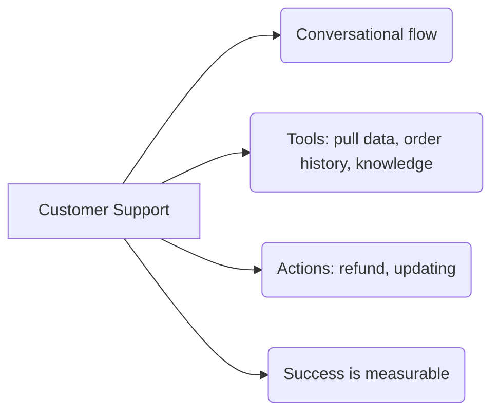
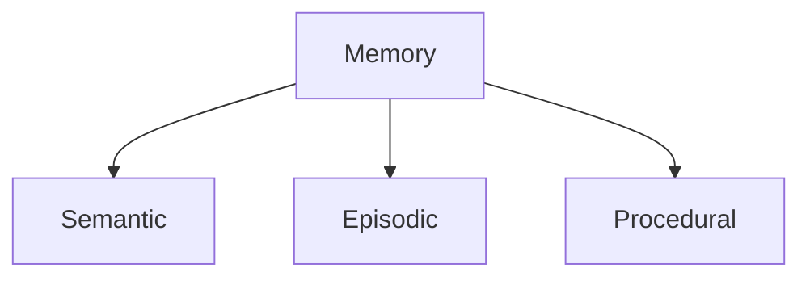

# Agentic AI Fundamentals: Conceptual Foundations for Practical Systems

Key concepts for designing and building LLM-based agentic systems, structured for technical implementation.

---

## 0. Prompt Engineering Best Practices
The prompt is the primary control surface. An effective prompt must include:

1. **Role and Task:** Explicitly define the model's identity and the specific objective.
2. **Dynamic or Retrieved Content:** Inject variable data or external search results at runtime.
3. **Detailed Instructions:** Eliminate ambiguity with precise, unambiguous directives.
4. **Examples and Counter-examples:** Provide few-shot samples of desired and undesired behavior.
5. **Critical Instruction Repetition:** Reinforce essential commands to ensure compliance.

---

## 1. Building Effective Agents
An agent's effectiveness depends on its ability to operate in a modular, measurable way.

* **Composable Patterns:** Build systems from reusable, interchangeable components.
* **Common Use Cases:**
    * **Customer Support:** Requires conversational flow, tool access (customer data, history, knowledge base), and execution capability (refunds, updates).
    * **Coding:** Iteration-driven, with continuous verification and a well-scoped problem space.
* **Tools:** The interface between the model and the environment (APIs, code execution).
* **Structured Outputs:** Agents must emit machine-readable responses (JSON, etc.) for downstream system integration.
* **Measurement:** Success must always be quantifiable — define output quality metrics and success criteria upfront.



---

## 2. Context Engineering
The discipline of selecting the optimal information for each inference step.

### Curation Strategies
* **Token Management:** Keep the active token set lean, including tokens sourced outside the initial prompt.
* **Attention Budget:** Model recall degrades as the context window grows (*context rot*) — prioritize high-signal information.
* **Context Operations:**
    * **Write:** Persist information outside the immediate context (e.g., documents, external memory).
    * **Select:** Pull only what is needed into the current context.
    * **Compress:** Summarize to reduce token footprint.
    * **Isolate:** Partition contexts to prevent interference or conflicts.

### Common Failure Modes
* **Context Poisoning:** Corrupt or incorrect data that triggers hallucinations.
* **Distraction:** Information overload that degrades model focus.
* **Confusion:** Leaking irrelevant context into the final output.
* **Context Clash:** Conflicting information from multiple sources within the same context window.


---

## 3. Agent Harness Anatomy
An agent is not just a model, it is an LLM plus a supporting runtime infrastructure.

LLMs can't:
- Maintain durable state across interactions.
- Execute code or perform actions.
- Access real-time information or external environments.    
- Setup environment configuration or install packages.

**Agent = Model + Harness**

### Harness Responsibilities
A bare model has hard limitations: no durable state, no code execution, no real-time knowledge, no environment configuration. The harness addresses these via:
* **Context Injection:** Supplies the task-relevant information the model needs.
* **Control and Decision Loop:** The model reasons and decides; the harness executes.
* **Observe-and-Verify Cycle:** The agent inspects action results and confirms success before proceeding.
* **Memory Persistence:**
    * **Semantic:** Concepts and meanings.
    * **Episodic:** Log of past events and experiences.
    * **Procedural:** Encoded know-how — how to perform tasks.


```mermaid
graph TD
    Input[Control / Input] --> Model
    Context[Context Injection] --> Model
    
    subgraph Harness [Execution Environment]
        Model{LLM Model: Reason and Decide}
        
        Model -->|Write| DB[(Persistence / Memory)]
        DB -->|Read| Model
        
        Model -->|Action| Tools[APIs / Code / Environment]
        Tools -->|Results| Model
        
        Model <-->|Observe / Verify| Check[Verification Layer]
    end
    
    Model --> Final[Action / Final Response]
````


---

## 4. Agents as Tool-Use Loops
At its core, an agent is an **LLM invoking tools in a loop**. Exploration lets the agent discover new context, extending its effective reach beyond the initial context window.

* **Sub-Agent Architectures:** Delegate complex subtasks to specialized child agents.
* **Scratchpad / Note-Taking:** Use external memory to manage long-horizon state.
* **Search Strategies:** Apply techniques such as beam search to explore multiple action paths in parallel.


