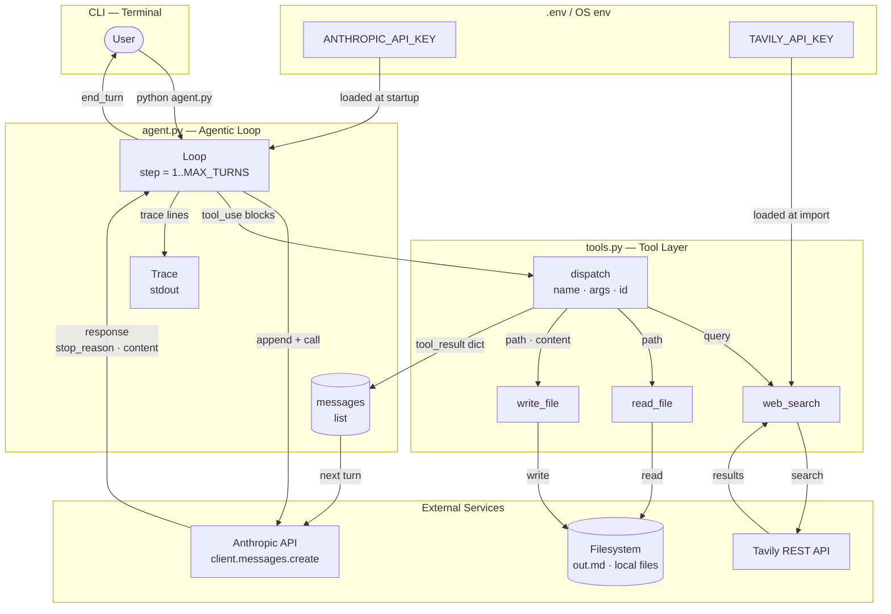

# Architecture — agent-from-scratch (Phase 1a)

> Every decision below traces to a user story in `docs/user-stories.md`.
> Principal Technical Agent's decisions take precedence on conflicts.

---

## 1. Stack Summary

| Layer | Technology | Justification |
|---|---|---|
| Language | Python 3.12 | Specified in phase-01_a; anthropic SDK is first-class Python |
| LLM API | `anthropic.messages.create` (raw SDK) | **Phase 1a spec** — no framework, no abstraction; teaches the primitive |
| Web retrieval | Tavily (`tavily-python`) | Specified in phase-01_a; simple REST client, free tier |
| Env management | `uv` | Project standard; never `pip` |
| Config | `python-dotenv` | Load `.env` at startup; env vars in shell take precedence |
| Persistence | Filesystem only | `write_file` → `out.md`; no DB, no cache |
| Frontend | None | Pure CLI — value is in the trace, not a UI |
| Container | None for phase 1a | Single venv via `uv` is sufficient; Docker deferred to phase 3 |

---

## 2. File & Folder Structure

```
agent-from-scratch/
├── agent.py          # Entry point: agentic loop, trace, tool dispatch (≤ 100 lines)
├── tools.py          # Tool implementations, JSON schemas, dispatch table
├── pyproject.toml    # uv project manifest — python = ">=3.12", runtime deps
├── .env              # Local secrets — GITIGNORED
├── .env.example      # Key names with placeholder values — committed
├── .gitignore        # Excludes: .env, __pycache__/, out.md, .venv/
├── README.md         # stop_reason reference, parallel tool_use, error handling
└── out.md            # Output artifact — written by agent at runtime (gitignored)
```

**No `src/` layout, no subdirectories, no tests/ in phase 1a.**

### Module responsibilities

**`agent.py`** — owns the loop, messages list, and tracing only.
- Calls `load_dotenv()` and instantiates `anthropic.Anthropic()`
- Builds the initial `messages` list (default task as first user turn)
- Runs the `while turn < MAX_TURNS` loop
- On `stop_reason == "tool_use"`: iterates **all** `tool_use` blocks, dispatches via `tools.dispatch()`, appends a single combined `tool_result` message
- On `stop_reason == "end_turn"`: prints `=== DONE ===` and breaks
- On `"max_tokens"` / bail-out: prints informative message and exits (US-003)
- Prints every trace line per US-002

**`tools.py`** — owns tool logic and schemas. Exports two names only:
- `TOOLS: list[dict]` — 3 Anthropic tool definition dicts (JSON schema)
- `dispatch(name, args, tool_use_id) -> dict` — single call site used by `agent.py`

### `agent.py` line budget

| Block | ~Lines |
|---|---|
| Imports | 4 |
| `load_dotenv()` + client | 2 |
| `DEFAULT_TASK`, `MAX_TURNS`, `MODEL` | 3 |
| `messages` init | 3 |
| Loop header + step print | 3 |
| `client.messages.create(...)` call | 6 |
| `stop_reason` print + assistant append | 3 |
| `end_turn` branch | 4 |
| `tool_use` branch + parallel dispatch | 14 |
| max_tokens / else bail-out | 4 |
| `__main__` guard | 2 |
| Blank lines + inline comments | ~10 |
| **Total** | **~58** |

Key enabler: all tool schemas and implementations live in `tools.py`, not `agent.py`.

---

## 3. State Management

| State | Lives in | Owner | Lifecycle |
|---|---|---|---|
| `ANTHROPIC_API_KEY` | OS env / `.env` | `agent.py` startup | Loaded once, never mutated |
| `TAVILY_API_KEY` | OS env / `.env` | `tools.py` module | Loaded once at import |
| `messages: list[dict]` | `agent.py` local scope | `agent.py` loop | Grows each turn; reset on new run |
| `TOOLS: list[dict]` | `tools.py` module constant | `tools.py` | Static; imported once |
| `turn: int` | `agent.py` loop var | `agent.py` loop | Increments per turn; resets on new run |
| `out.md` | Filesystem (CWD) | `write_file` tool | Created/overwritten by agent |
| Anthropic client | `agent.py` local | `agent.py` | One instance per run |
| Tavily client | `tools.py` module-level | `tools.py` | One instance per process |

**Cross-module interface:** `agent.py` imports `tools.TOOLS` and calls `tools.dispatch(name, args, id) -> dict`. No shared mutable state.

### Messages list growth

Each turn appends at most 2 messages (assistant + user/tool_results). For the default task (≤ 8 turns):

- ~12 k tokens peak across all turns — well inside the 200 k context window
- `MAX_TURNS = 10` hard-stop is the only safety valve needed for phase 1a

---

## 4. Service Connections

```
┌─────────────────────────────────────────────────────────────┐
│  Terminal (user)                                            │
│   python agent.py                                          │
└──────────────────────┬──────────────────────────────────────┘
                       │ stdin/stdout
                       ▼
┌─────────────────────────────────────────────────────────────┐
│  agent.py                                                   │
│  ┌──────────────┐    client.messages.create(...)           │
│  │ messages []  │ ──────────────────────────────────────►  │
│  │ (in-memory)  │                                          │
│  └──────────────┘ ◄──────────────────────────────────────  │
│        │                 response (stop_reason, content)   │
│        │ dispatch(name, args, id)                          │
│        ▼                                                    │
│  tools.py                                                   │
│  ├── web_search(query) ──────────────────────────────────► Tavily REST API
│  ├── read_file(path)   ──────────────────────────────────► Filesystem
│  └── write_file(path, content) ─────────────────────────► Filesystem
└─────────────────────────────────────────────────────────────┘
         │                              │
         ▼                              ▼
 Anthropic API              out.md / local files
 (HTTPS, api.anthropic.com)
```

### API call pattern

```python
response = client.messages.create(
    model="claude-opus-4-5",          # or claude-3-5-sonnet-latest
    max_tokens=4096,
    tools=TOOLS,                      # imported from tools.py
    messages=messages,                # full accumulated history
)
```

`client.messages.create` is the **only** Anthropic SDK call in the project. No streaming, no beta endpoints.

### Auth flow

- `anthropic.Anthropic()` reads `ANTHROPIC_API_KEY` from env automatically
- `TavilyClient(api_key=os.environ["TAVILY_API_KEY"])` — explicit; raises `KeyError` at startup if missing (fail-fast before the loop)

---

## 5. Docker & Deployment

**Phase 1a: no Docker required.**

```bash
# Setup
uv venv
uv pip install -e .

# Run
python agent.py
```

**Future phase 3 target image** (reference only):
```dockerfile
FROM python:3.12-slim
WORKDIR /app
COPY pyproject.toml .
RUN pip install uv && uv pip install --system -e .
COPY agent.py tools.py .
CMD ["python", "agent.py"]
```
Target image size: < 200 MB.

### `pyproject.toml`

```toml
[project]
name = "agent-from-scratch"
version = "0.1.0"
requires-python = ">=3.12"
dependencies = [
    "anthropic>=0.25",
    "tavily-python>=0.3",
    "python-dotenv>=1.0",
]

[build-system]
requires = ["hatchling"]
build-backend = "hatchling.build"

[tool.uv]
dev-dependencies = [
    "pytest>=8",
    "pytest-mock>=3",
]
```

---

## 6. Database Schema

No database. State contracts are filesystem + in-memory only.

### In-memory message types (TypedDict style)

```python
class TextBlock(TypedDict):
    type: Literal["text"]
    text: str

class ToolUseBlock(TypedDict):
    type: Literal["tool_use"]
    id: str          # must be echoed as tool_use_id in the reply
    name: str
    input: dict

class ToolResultBlock(TypedDict):
    type: Literal["tool_result"]
    tool_use_id: str  # matches ToolUseBlock.id
    content: str
    is_error: NotRequired[bool]

AssistantContent = list[TextBlock | ToolUseBlock]
UserContent      = str | list[ToolResultBlock]
```

### Tool result contracts

| Tool | Success return | Error return |
|---|---|---|
| `web_search` | `str` — formatted list of `title\nurl\nsnippet` per result | `"Error: Tavily – <message>"` |
| `read_file` | `str` — full UTF-8 file content | `"Error: file not found – <path>"` or `"Error: not a text file"` |
| `write_file` | `"OK: wrote N bytes to <path>"` | `"Error: directory not found – <path>"` |

All tools return `str`, never raise. Errors follow `"Error: <reason> – <detail>"` so the model can parse them.

### `out.md` format

```markdown
# Anthropic Engineering Blog — Last 5 Posts

## 1. <Post Title>
**URL:** https://anthropic.com/engineering/...
<2–4 sentence summary>

## 2. ...
```

Expected size: 1.2–2.5 KB. Minimum 100 chars (US-006 acceptance criterion).

### `.env` schema

| Variable | Required | Default | Description |
|---|---|---|---|
| `ANTHROPIC_API_KEY` | ✓ | — | Anthropic API key |
| `TAVILY_API_KEY` | ✓ | — | Tavily search API key |
| `MODEL` | | `claude-opus-4-5` | Anthropic model name |
| `MAX_TURNS` | | `10` | Hard stop for the agent loop |
| `MAX_RESULT_CHARS` | | `500` | Tool result truncation length for trace |

---

## 7. Testing Strategy

**Phase 1a scope:** unit tests for tool functions only. Integration test for the loop is manual (run `python agent.py` and observe trace).

### Unit tests (`tests/test_tools.py`)

| Test | What it checks |
|---|---|
| `test_read_file_exists` | Returns file content for a fixture file |
| `test_read_file_missing` | Returns `"Error: file not found – ..."` |
| `test_read_file_binary` | Returns `"Error: not a text file"` |
| `test_write_file_creates` | Creates file and returns `"OK: wrote N bytes..."` |
| `test_write_file_bad_dir` | Returns `"Error: directory not found – ..."` |
| `test_web_search_mock` | Mocked Tavily returns ≥ 1 result with title + URL |
| `test_dispatch_unknown` | Unknown tool name returns `is_error: True` |
| `test_dispatch_exception` | Tool that raises → `is_error: True` |

### CI skeleton (`.github/workflows/ci.yml`)

```yaml
on: [push, pull_request]
jobs:
  test:
    runs-on: ubuntu-latest
    steps:
      - uses: actions/checkout@v4
      - uses: astral-sh/setup-uv@v3
      - run: uv venv && uv pip install -e ".[dev]"
      - run: pytest tests/ -v
```

### Behaviour validation (US-001, task validation rule)

After unit tests pass, run:
```bash
python agent.py 2>&1 | tee trace.txt
grep -c "^--- Step" trace.txt    # ≥ 1
grep "=== DONE ===" trace.txt    # must exist
wc -c out.md                     # ≥ 100 bytes
wc -l agent.py                   # ≤ 100 lines
```
A task is only "Success" when behaviour is confirmed, not just when tests pass.

---

## 8. Architecture Diagram



---

## 9. Long-Term Considerations

### Security posture

- API keys: never in code; `.env` is gitignored; `.env.example` is the only committed credential artifact (US-009, US-011)
- `write_file` path traversal: paths outside CWD are accepted in phase 1a — documented in README as a **known limitation**. Sandbox in phase 2.
- `read_file` no sandboxing: intentional per US-005; document as such.
- Startup validator: raise `ValueError` with a clear message if required env vars are absent — fail before the first API call.

### Observability

Stdout IS the observability layer for phase 1a. Every `print` call has a defined contract:

| Line | Meaning |
|---|---|
| `--- Step N ---` | Turn N beginning |
| `stop_reason: <value>` | API's decision for this turn |
| `  tool: <name>  args: <input>` | Tool about to be called |
| `  result: <truncated>` | Tool result (≤ 500 chars) |
| `=== DONE ===` | Loop exited cleanly on `end_turn` |
| `Max turns reached` | Hard stop at `MAX_TURNS` |

Redirect options: `python agent.py 2>&1 | tee trace.txt` or `python agent.py > trace.txt`.

### Scalability trade-offs

- Single-turn CLI script — horizontal scaling is irrelevant in phase 1a.
- Context window: ~12 k tokens for the default task across ≤ 8 turns — no risk.
- Tavily free tier: 1,000 searches/month. Document in README.
- `anthropic.messages.create` is synchronous and blocking — suitable for CLI; replace with async in phase 3.

### Known trade-offs (phase 1a)

| Trade-off | Decision | Future resolution |
|---|---|---|
| No tests for the loop | Manual behaviour validation is sufficient for a 58-line script | Phase 1b: mock `client.messages.create` and test loop branches |
| No streaming | Simpler; full response needed to detect parallel tool calls | Phase 2: use streaming + tool_use event accumulator |
| No retry on Anthropic errors | Fails the run; user must re-run | Phase 2: exponential backoff wrapper |
| No sandboxing on file tools | Intentional; educational context | Phase 2: restrict to CWD |

### Evolution roadmap

- **Phase 1b** — swap `anthropic.messages.create` for higher-level Agents SDK; same tools
- **Phase 2** — add streaming, memory (vector store), more tools, retry logic
- **Phase 3** — wrap in FastAPI + SSE, structured JSON logging, Docker, multi-user
